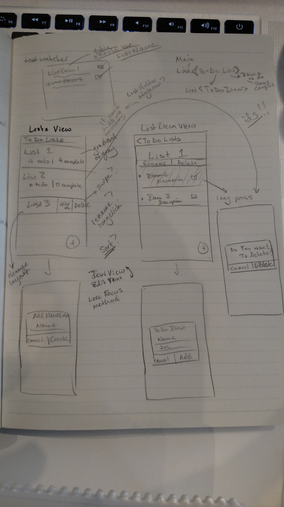

#### To Do List App

The app has two screens. The first allows for the user to create new Lists and shows them how many To Do Items are complete or still need to be done.
The second allows the user to create new To Do Items, mark them done, rename or re-describe them, rename the List, or delete any item/list.

Deletes work with a button for lists, on long press for items.
Adds work through the FAB.
Renames are triggered by tapping on the text in the second screen.

----
#### Prototype
The prototype on one page in a notebook:

  

----
#### Homepage

  

